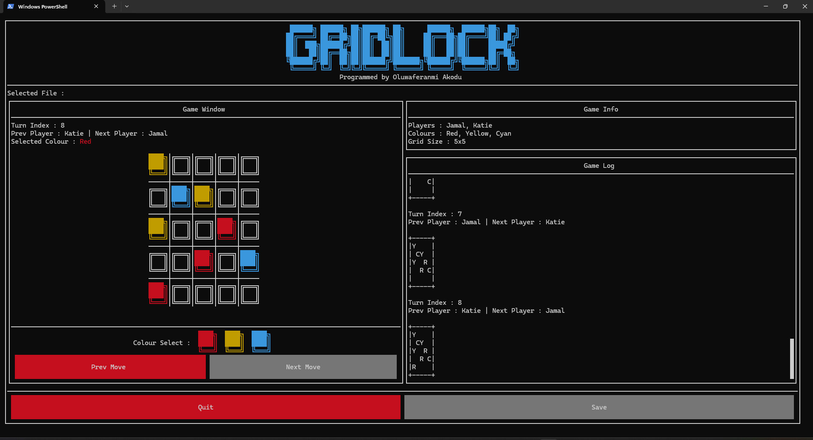

# Gridlock (CS141 Coursework 2) | Overall Mark: 95%  
> **University of Warwick — Department of Computer Science**  
> Module: [*CS141 — Functional Programming*](https://warwick.ac.uk/fac/sci/dcs/teaching/modules/cs141/)  
> Academic Year: *2024/25*  

## 📋 Description  
This repository contains my coursework submission for the module *CS141 - Functional Programming*. The project implements a **Haskell program** to parse, display, and play Gridlock games, as specified in the assignment. Gridlock is a two-player colouring game where players take turns colouring cells on a grid without matching adjacent colours. The program includes:  
- A parser for `.gridlock` files with syntactic and semantic validation.  
- A terminal-based UI for interactive gameplay.  
- Features for saving and loading game files.  

The project exceeded the minimum requirements by adding a fully playable UI and file management system, earning high marks for functionality, elegance, and documentation.  

## 📸 Demonstrations  
- [Video Playlist: Loading, Error Handling, and Gameplay](https://youtube.com/playlist?list=PLY4lCnYQQkJXnH8pamYGNxL2PKemjFeXJ)  


## 🎮 Features  
### Core Requirements  
✅ **Parsing & Validation**  
- Parse `.gridlock` files using Megaparsec, checking for syntactic and semantic errors (e.g., invalid moves, missing components).  
- Represent game states as an Abstract Syntax Tree (AST) for validation.  

✅ **Grid Display**  
- Render grids with coloured borders and cells using ANSI escape sequences (via `drawGrid`).  

### Extensions  
✨ **Interactive Terminal UI**  
- Built with the `Brick` library, featuring:  
  - A file browser to load/save games.  
  - Real-time gameplay with click-to-move functionality.  
  - Error handling screens for invalid inputs.  

✨ **Gameplay & Saving**  
- Play Gridlock against another player locally.  
- Save game progress to `.gridlock` files by reconstructing moves from grid states.  

## 🛠️ Technologies  
- **Languages**: Haskell (GHC 9.4.8)  
- **Libraries**:  
  - [`Megaparsec`](https://hackage.haskell.org/package/megaparsec) for parsing.  
  - [`Brick`](https://hackage.haskell.org/package/brick) for terminal UI.  
- **Tools**: VS Code, Haskell Language Server, Stack.  

## 📂 Repository Structure  
```plaintext
├── report.pdf           # Coursework report (design choices, challenges, resources)  
├── assignment.pdf       # Original coursework brief  
├── feedback.pdf         # Lecturer feedback (95/100)  
├── code/...             # Source code  
└── README.md            # This file
```

## 🚀 Getting Started

### 🔧 Prerequisites

- Follow the instructions for installing ghcup [on the Haskell.org website](https://www.haskell.org/ghcup/). Answer A
then Y then Y to the three prompts.

- If you are using VSCode, install the haskell extension after installing ghcup and it
will automatically initialise the toolchain once you open a Haskell file in a properlyconfigured project folder. If not using VSCode, please install ghc version 9.4.8;
and stack and cabal recommended versions according to ghcup.

### 🏃‍♂ Running

- Clone the repository

- Navigate to the `code\` directory and execute the command `stack run`

## ⚠️ Disclaimer

- Student ID and confidential information have been removed.
- Please do not redistribute or submit as your own work.
